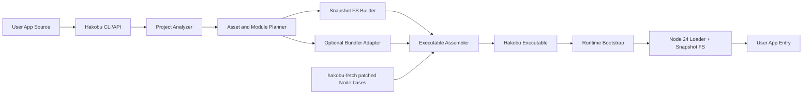
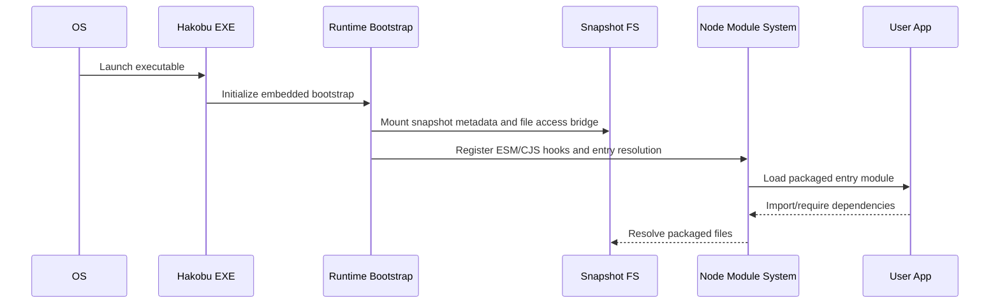

# Feature Design

## Overview

`Hakobu` is a fork-based successor to `@yao-pkg/pkg` and
`@yao-pkg/pkg-fetch`. The project retains the proven `pkg` model:

- patched Node base binaries
- packaged snapshot filesystem
- runtime bootstrap inside the executable

The new work is concentrated in two areas:

1. `Node 24.x` runtime support
2. native ESM semantics from the packaged runtime itself

This design deliberately avoids making bundling the foundation. Optional bundle
mode can exist for convenience, but Hakobu must be able to package a normal
multi-file Node application without forcing it through a single bundled entry.

## Goals

- Support `Node 24.x` LTS as the primary runtime line
- Execute native ESM entrypoints and module graphs from the packaged runtime
- Preserve CommonJS compatibility
- Preserve Node child-process semantics, including custom `stdio` descriptors
- Keep a snapshot filesystem model rather than SEA's single-injected-script
  model
- Support GitHub Actions based public OSS release automation

## Non-Goals

- Rewriting the packager from zero before validating the fork path
- Matching every historical `pkg` quirk if it conflicts with Node 24 behavior
- Making bundle mode mandatory
- Embedding every external binary into the executable by default

## Architecture Decision Summary

- Start from a fork of `@yao-pkg/pkg` and `@yao-pkg/pkg-fetch`
- Preserve the snapshot filesystem architecture
- Heavily refactor the bootstrap and loader layers
- Use Node 24 module hooks where they simplify ESM bridging
- Keep the runtime dual-stack: native ESM and CommonJS
- Treat Windows Playwright/Camoufox as a top-tier acceptance workload
- Use GitHub Actions for public CI/CD

## High-Level Architecture



## Repository and Package Layout

The fork should be reorganized into a monorepo so the patched binary pipeline
and user-facing CLI can evolve independently.

```text
hakobu/
├── packages/
│   ├── hakobu/                 # CLI + programmatic API
│   ├── hakobu-fetch/           # patched Node source/binary manager
│   ├── hakobu-runtime/         # shared bootstrap/runtime assets
│   └── hakobu-tests/           # executable fixture harness
├── patches/
│   └── node/24.x/              # Node source patches
├── fixtures/
│   ├── esm-basic/
│   ├── esm-exports-imports/
│   ├── mixed-cjs-esm/
│   ├── workers/
│   ├── addons/
│   └── playwright-camoufox/
└── .github/workflows/
```

## Fork Strategy

### Why Fork

Forking is the lower-risk starting point because the inherited code already
provides:

- executable assembly flow
- snapshot metadata format
- patched-base runtime pipeline
- target naming and release conventions
- a migration path for existing `pkg` users

Starting from scratch would still require rebuilding all of those layers before
the real differentiators, Node 24 support and native ESM, could be validated.

### Fork Scope

The project should fork both:

- `@yao-pkg/pkg`
- `@yao-pkg/pkg-fetch`

`hakobu-fetch` remains the authority for building and publishing patched Node
bases. `hakobu` consumes those bases and focuses on packaging logic, runtime
bootstrap, diagnostics, and compatibility features.

## Runtime Model

Hakobu executables have four runtime layers:

1. Patched Node binary
2. Snapshot filesystem bridge
3. Runtime bootstrap
4. User application entrypoint

### Startup Sequence



### Patched Node Binary

The patched Node binary remains responsible for:

- exposing the snapshot blob to runtime code
- enabling read-only file operations against packaged content
- preserving Node child-process semantics
- ensuring internal module resolution can address packaged paths

The patch set should be minimized and grouped by concern:

- snapshot blob access
- filesystem hooks
- process bootstrap hooks
- child-process and worker propagation

## Snapshot Filesystem Design

### Canonical Behavior

The snapshot filesystem remains read-only and must look real enough that Node
resolution and `fs` APIs can operate on it predictably.

Required operations:

- `readFile`
- `open`
- `stat` and `lstat`
- `readdir`
- `realpath`
- module path inspection for ESM and CommonJS

### Canonical Path Strategy

The runtime should preserve a synthetic but stable filesystem root:

- POSIX: `/snapshot/<app>/...`
- Windows: `C:\\snapshot\\<app>\\...`

This keeps the execution model close to historical `pkg` behavior while letting
Node build normal `file:` URLs for ESM modules.

Key rule:
- snapshot metadata is stored in normalized POSIX form
- runtime path adapters project it into platform-native path form when required

### Asset Classification

Hakobu should classify packaged inputs into three categories:

1. `scripts`
   JS, MJS, CJS, JSON, WASM, and package metadata used by module resolution
2. `assets`
   runtime-read files such as templates, text, binaries, and static resources
3. `externals`
   files intentionally kept outside the executable

This preserves the old `pkg` mental model while allowing clearer diagnostics.

## Native ESM Design

### Design Principle

Native ESM support shall come from the runtime, not from mandatory bundling or a
CommonJS wrapper.

### ESM Responsibilities

Hakobu must support:

- ESM entrypoints
- static `import`
- dynamic `import()`
- `package.json` `type`
- `exports`
- `imports`
- `import.meta.url`
- `createRequire()`
- mixed ESM/CommonJS graphs
- source maps and stack traces that map back to packaged paths

### Loader Strategy

Node 24's module customization hooks are the preferred extension point for ESM.
The runtime bootstrap should register hooks before loading the packaged entry.

Responsibilities of the ESM hook layer:

- translate the packaged entrypoint into a canonical `file:` URL
- resolve bare specifiers through packaged `package.json` data
- enforce package boundary rules from `exports` and `imports`
- return source bytes from the snapshot bridge when the target lives inside the
  packaged filesystem
- delegate built-ins and real external filesystem modules back to Node

### Why Hooks Are Not the Whole Solution

Hooks alone are not enough. Node subsystems still expect path-oriented behavior
for stack traces, source maps, workers, and mixed loader interactions. That is
why the filesystem bridge remains a first-class part of the design.

### `import.meta.url`

`import.meta.url` shall use the canonical packaged `file:` URL for the module.
That keeps behavior close to normal Node apps and avoids inventing a custom URL
scheme for user code.

### Dynamic `import()`

Dynamic imports follow the same packaged resolution rules as static ESM
resolution. The bootstrap must ensure the current module URL and package context
are available so relative and bare imports resolve correctly.

### `exports` and `imports`

Hakobu must evaluate package boundary rules exactly once through a shared
resolver used by both static and dynamic imports.

The resolver should:

- load packaged `package.json` data from snapshot metadata
- cache parsed package manifests
- apply Node 24 condition matching
- return canonical snapshot-backed file paths or URLs

## CommonJS Design

CommonJS remains a first-class runtime, not a compatibility shim.

Responsibilities:

- `require()` resolution inside snapshot
- `require.resolve()`
- JSON loading
- coexistence with ESM through Node interop rules
- executable startup for CommonJS entrypoints

The runtime should preserve as much inherited `pkg` CommonJS behavior as
possible unless it conflicts with Node 24 semantics.

## Interop Between ESM and CommonJS

Interop design rules:

- CommonJS `require()` may load CommonJS directly from snapshot
- CommonJS loading of ESM should follow Node's supported interop path
- ESM calling `createRequire(import.meta.url)` shall work for snapshot modules
- package format is determined from packaged package metadata, not file extension
  alone

## Child Process and Worker Design

This area is a release blocker because it is the core differentiator versus Bun
compile for the Camoufox use case.

### Child Processes

The packaged executable must preserve Node process semantics for:

- `spawn`
- `exec`
- `execFile`
- `fork`
- custom `stdio` arrays, including file descriptors greater than `2`

For `fork`, the child process should relaunch the same executable with runtime
metadata that identifies the packaged child entrypoint.

### Windows Playwright/Camoufox Workload

Acceptance case:

- packaged app launches Playwright
- Playwright launches Camoufox/Firefox with `-juggler-pipe`
- Node child process preserves `stdio[3]` and `stdio[4]`
- browser handshake completes

This is not a nice-to-have test. It is a release gate for Windows support.

### Workers

`worker_threads` must support:

- worker entrypoints inside snapshot
- relative imports or requires from worker code
- message passing parity with unpackaged execution

The worker bootstrap should reuse the same runtime initialization path with a
worker-specific entry selector.

## Native Addons and External Binaries

### Native Addons

`.node` addons cannot be loaded directly from an in-memory snapshot. Hakobu
should extract them to a deterministic runtime cache.

Rules:

- extracted path includes content hash and target metadata
- extraction is idempotent
- permissions are narrowed to the minimum required by the platform
- stale caches can be garbage-collected safely

### External Binaries

Large or independently updated binaries should usually remain external.

Examples:

- browsers
- ffmpeg
- custom helper daemons

Hakobu should allow users to declare such artifacts explicitly and reference
them from the packaged app through stable runtime helpers.

## Packaging Pipeline

### Analysis Phase

The packager first builds a project manifest:

- entrypoint format
- dependency graph
- package metadata used for resolution
- scripts
- assets
- native addons
- externals

### Assembly Phase

The packager then:

1. resolves target runtime base
2. normalizes the packaged file graph
3. builds the snapshot blob and metadata indexes
4. injects bootstrap assets
5. assembles the executable

### Optional Bundle Mode

Bundle mode is an adapter in front of the normal pipeline, not a replacement for
the runtime.

Supported goals:

- reduce module count
- simplify hard-to-analyze dependency trees
- improve cold start

Bundle mode must remain optional and documented as such.

Rolldown is the preferred first bundler integration because it aligns with the
Rollup model while being fast enough for CLI workflows.

## CLI and Configuration Design

### CLI Commands

Initial commands:

- `hakobu package`
- `hakobu doctor`
- `hakobu inspect-targets`
- `hakobu explain`

### Config Surface

Supported configuration concepts:

- `targets`
- `entry`
- `scripts`
- `assets`
- `externals`
- `bundle`
- `compression`
- `runtimeFlags`
- `output`

Migration aliases can be accepted for legacy `pkg` users, but internal config
should normalize to one modern schema.

## Data Models

### Packaging Manifest

```ts
interface PackagingManifest {
  projectRoot: string
  entry: string
  format: "esm" | "cjs" | "auto"
  targets: RuntimeTarget[]
  scripts: ManifestFile[]
  assets: ManifestFile[]
  externals: ExternalArtifact[]
  nativeAddons: NativeAddonArtifact[]
  packageMetadata: PackagedPackageMetadata[]
  bundleMode: BundleModeConfig | null
}
```

### Runtime Target

```ts
interface RuntimeTarget {
  platform: "linux" | "win" | "macos"
  arch: "x64" | "arm64"
  nodeLine: "24"
  nodeVersion: string
}
```

### Snapshot Index

```ts
interface SnapshotEntry {
  path: string
  kind: "script" | "asset" | "package-json" | "native-addon-placeholder"
  mode: number
  size: number
  offset: number
  hash: string
}

interface SnapshotIndex {
  appId: string
  entries: SnapshotEntry[]
  packageBoundaries: Record<string, PackageBoundary>
}
```

## Error Handling

Errors should be phase-specific and user-readable.

Error families:

- analysis errors
- target resolution errors
- snapshot assembly errors
- runtime bootstrap errors
- ESM resolution errors
- addon extraction errors
- unsupported feature diagnostics

Every top-level error should include:

- phase
- artifact or module path
- target
- probable remediation

## CI/CD Design

### Primary Platform

GitHub Actions is the default CI/CD platform for public OSS.

Workflows:

- `ci.yml`
  lint, unit tests, fixture tests
- `build-bases.yml`
  build patched Node bases for supported targets
- `release.yml`
  publish binaries, packages, checksums, and release notes

### Artifact Strategy

Publish:

- patched runtime bases
- package manager tarballs
- release notes
- checksums
- SBOM or provenance metadata when available

## Testing Strategy

### Test Layers

1. Unit tests
   resolver logic, manifest planning, snapshot indexing
2. Integration tests
   packaging fixtures and comparing unpackaged vs packaged behavior
3. Executable smoke tests
   platform-targeted runtime validation
4. Release-gate tests
   Windows Playwright/Camoufox, workers, native addons, and mixed-module apps

### Required Fixtures

- pure ESM app
- CommonJS app
- mixed ESM/CommonJS app
- `exports` and `imports` package fixture
- `import.meta.url` fixture
- dynamic `import()` fixture
- worker fixture
- native addon fixture
- external binary fixture
- Playwright/Camoufox fixture

## Migration Plan

### From `pkg` / `yao-pkg`

Migration should be staged:

1. package basic CommonJS apps
2. package modern ESM apps
3. support process-heavy apps
4. document changed defaults and removed legacy behavior

### Compatibility Policy

Compatibility priority:

1. Node 24 semantics
2. Hakobu documented behavior
3. inherited `pkg` compatibility where it does not conflict with 1 or 2

## Open Questions

These are implementation questions, not blockers for the initial spec:

- ~~whether `win-arm64` should be first-release or deferred~~
  **Resolved:** deferred (Tier 3). See `docs/target-policy.md`.
- whether bundle mode ships in alpha or after native mode is stable
- how much of the old `pkg` config schema should be accepted verbatim
- whether native addon extraction uses temp or content-addressed cache by default

